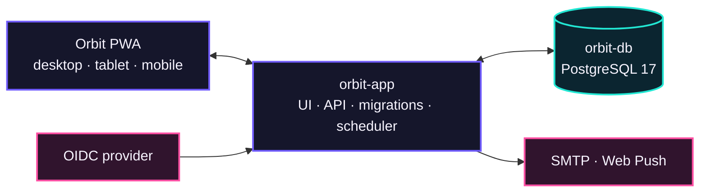

> [!IMPORTANT]
> **Development disclosure:** Orbit was coded by OpenAI Codex under human
> direction.

<p align="center">
  
</p>

<h1 align="center">Orbit</h1>

<p align="center">
  <strong>Everything in your orbit, on track.</strong>
</p>

<p align="center">
  A modern, self-hosted home operations hub for maintenance, renewals,<br />
  recurring services, contracts, cover, and the people who share them.
</p>

<p align="center">
  
  
  
  
  
</p>

<p align="center">
  
</p>

## Quick start

From an empty directory on a Linux host with Git and Docker Compose v2:

```bash
bash <(curl -fsSL https://raw.githubusercontent.com/tomlawesome/orbit/main/scripts/install.sh)
```

The installer downloads Orbit into the current directory, creates `.env` from
the supplied example when needed, and asks whether to build the application
container locally:

- answer **Y/Yes** (or press Enter) to pull current base images and build
  `orbit-app` from source;
- answer **N/No** to pull `ghcr.io/tomlawesome/orbit:latest` from GitHub
  Container Registry instead.

It then starts `orbit-app` and the official PostgreSQL `orbit-db` service in the
background and displays their status. The published Orbit image supports both
64-bit x86 (`linux/amd64`) and 64-bit ARM (`linux/arm64`) hosts.

## Your home has an orbit

Boilers need servicing. Insurance renews. Cars need inspections. Devices leave
warranty. Contracts roll over. Orbit brings those scattered responsibilities
into one calm, shared view—so the important things stay visible before they
become urgent.

<table>
  <tr>
    <td width="33%" valign="top">
      <h3>See what is next</h3>
      <p>A focused, urgency-aware workspace brings upcoming work, overdue items, and recently completed tasks into view.</p>
    </td>
    <td width="33%" valign="top">
      <h3>Keep the rhythm</h3>
      <p>Complete, renew, reschedule, snooze, cancel, restore, and automatically calculate the next recurring date.</p>
    </td>
    <td width="33%" valign="top">
      <h3>Share the load</h3>
      <p>Household owners can add existing Orbit users by display name—without invitations or exposed email addresses.</p>
    </td>
  </tr>
</table>

## Designed around your household

- **A workspace that reads at a glance** — responsive Due Next view, search,
  urgency filters, household switching, section views, and mobile navigation.
- **Sections that fit your life** — add, rename, reorder, recolour, hide, or
  restore sections, with Home, Vehicles, Devices, and Services included by
  default.
- **Appearance with personality** — independent light, dark, and system modes
  across Orbit After Dark, Verdant, Coast, Berry, and Ember colourways.
- **A complete record of care** — item details, schedule history, activity
  timelines, archived records, reminders, and notification state.
- **Useful even when disconnected** — an installable PWA with IndexedDB
  snapshots, queued offline changes, explicit sync state, an offline shell, and
  service-worker push handling.
- **Private by design** — provider-neutral OIDC, opaque server-side sessions,
  PKCE, signed token validation, same-origin enforcement, CSRF protection, and
  authenticated household APIs.

## One app. One standard database.

Orbit deliberately keeps the operational footprint small:



- `orbit-app` is the complete Orbit application: interface, authenticated
  APIs, versioned migrations, and notification scheduler. It can be built from
  source or pulled as `ghcr.io/tomlawesome/orbit:latest`.
- `orbit-db` is the unmodified official `postgres:17-alpine` image with a
  persistent volume.

There is no custom PostgreSQL image and no separate backend container to
maintain.

## Run with Docker

### 1. Create the runtime configuration

```sh
cp .env.example .env
```

On PowerShell, use `Copy-Item .env.example .env`.

At minimum, replace the example session secret and configure your OIDC
provider. SMTP and VAPID values are required when you are ready to exercise
email and browser-push delivery.

### 2. Start Orbit

```sh
docker compose up --build
```

Open [http://127.0.0.1:3000](http://127.0.0.1:3000). The health endpoint is
available at `/api/health`.

The application waits for PostgreSQL, applies versioned migrations, starts the
notification scheduler, and then serves the full-stack application.

> [!IMPORTANT]
> Keep `APP_URL`, the address used in the browser, and the OIDC callback host
> identical. Do not switch between `localhost` and `127.0.0.1` during a sign-in
> attempt.

### Update and launch an existing checkout

Once the host has a configured `.env`, update and start Orbit with:

```sh
./scripts/update-and-start.sh
```

The script fast-forwards the current Git branch, pulls the official PostgreSQL
image, refreshes the application build layers, rebuilds `orbit-app`, starts the
stack in the background, and prints the resulting service status. It stops
immediately if Git, Docker Compose v2, or `.env` is unavailable.

## Explore without infrastructure

Orbit remains interactive when PostgreSQL and OIDC are unavailable. The preview
adapter provides representative household records, persists changes on the
device, and exercises the same service boundary as the authenticated
application.

```sh
pnpm install
pnpm dev
```

This makes it possible to evaluate the interface and workflows before
configuring production services.

## Production foundation

Orbit already includes:

- guided household setup and owner-controlled membership;
- create, edit, schedule, remind, archive, undo, and restore workflows;
- recurrence suggestions and household-local calendar-date rules;
- a schedule-aware notification centre with read, dismiss, and snooze state;
- PostgreSQL/Drizzle models for users, sessions, households, memberships,
  items, events, reminders, push devices, delivery state, and audit history;
- provider-neutral OpenID Connect discovery and Authorization Code flow with
  S256 PKCE;
- just-in-time user provisioning and immutable issuer/subject identities;
- SMTP and Web Push delivery through an atomic PostgreSQL-backed scheduler;
- production health checks, standalone Next.js output, and version-controlled
  migrations.

When an authenticated session and PostgreSQL are present, Orbit automatically
upgrades from the local preview adapter to validated server APIs, retains an
IndexedDB snapshot, and synchronises queued offline changes.

## Local development

### Requirements

- Node.js 22 or later
- pnpm 10
- PostgreSQL 17, or Docker for the database only

### Start the development stack

```sh
pnpm install
cp .env.example .env
pnpm db:migrate
pnpm dev
```

To run only PostgreSQL in Docker:

```sh
docker compose up -d orbit-db
```

The default `DATABASE_URL` in `.env.example` connects to that database from the
host.

### Quality checks

```sh
pnpm typecheck
pnpm lint
pnpm test
pnpm build
```

The current suite contains 33 unit tests across authentication, environment
validation, recurrence, preferences, notifications, workspace commands, and
the notification worker.

## Configuration

All supported runtime variables are documented in
[`.env.example`](.env.example). The main groups are:

| Area | Variables |
| --- | --- |
| Application | `APP_URL`, `SESSION_SECRET`, `SESSION_TTL_SECONDS` |
| Database | `DATABASE_URL`, `POSTGRES_DB`, `POSTGRES_USER`, `POSTGRES_PASSWORD` |
| Identity | `OIDC_ISSUER`, `OIDC_CLIENT_ID`, `OIDC_CLIENT_SECRET`, `OIDC_CALLBACK_URL` |
| Email | `SMTP_URL`, `SMTP_FROM` |
| Browser push | `VAPID_SUBJECT`, `VAPID_PUBLIC_KEY`, `VAPID_PRIVATE_KEY` |
| Worker | `WORKER_ENABLED`, `WORKER_POLL_SECONDS`, `NOTIFICATION_MAX_ATTEMPTS` |
| Migrations | `MIGRATE_ON_START`, `DRIZZLE_MIGRATIONS_PATH` |

For production, use HTTPS, strong unique secrets, a private PostgreSQL
connection, and valid OIDC, SMTP, and VAPID credentials. Back up the PostgreSQL
volume before storing real household data.

See [Authentication and Authentik setup](docs/authentication.md) for provider
configuration, endpoint behaviour, security details, and troubleshooting.

## Before the first real launch

1. Apply the migrations to a disposable PostgreSQL instance and exercise OIDC
   sign-in with the intended provider.
2. Verify one SMTP delivery and one browser-push delivery with production-like
   credentials.
3. Run browser end-to-end and accessibility checks against the production
   build.
4. Configure automated PostgreSQL backups and a tested restore procedure.

---

<p align="center">
  
  <br />
  <strong>Everything in your orbit, on track.</strong>
</p>
