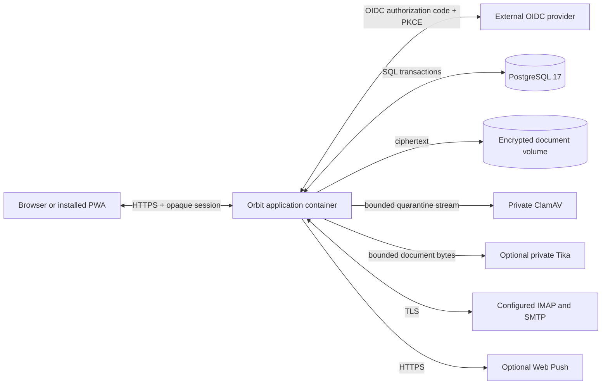

# Orbit architecture and operations baseline

## System context

Orbit is a modular full-stack application deployed as one container. The
browser never talks directly to PostgreSQL, document storage, ClamAV, Tika,
IMAP, SMTP, or Web Push providers.

The supported topology and deferred alternatives are recorded in
[ADR-0001](adr/0001-self-hosted-single-instance.md).

## Application boundaries

| Boundary | Responsibility | Current implementation |
| --- | --- | --- |
| Next.js routes | HTTP parsing, session/CSRF enforcement, cache policy, response mapping | `src/app/api` |
| Authentication | OIDC discovery/callback, claim validation, provisioning, sessions | `src/lib/auth` |
| Domain and workspace | Item, schedule, section, notification and household command contracts | `src/lib`, `src/server/workspace-*` |
| Authorization | Instance, household, owner and document access decisions | `src/server/authorization.ts`, `workspace-access.ts`, document authorization |
| Persistence | Versioned Drizzle schema, migrations and transactional repositories | `src/db`, `drizzle`, repository modules |
| Documents | Validation, scanning, encryption, storage, drafts and reconciliation | `src/server/documents`, document repositories/workers |
| Integrations | OIDC, ClamAV, Tika, IMAP, SMTP and Web Push adapters | focused library/server modules |
| Operations | Health, safe administrator views, backup, restore and release scripts | administrator modules and `scripts` |

Routes remain thin. Business rules and authorization must live in reusable
server/domain boundaries so they can be integration-tested without a browser.

## Trust boundaries

1. **Unauthenticated network:** no household, document, archive, account, or
   operations metadata is disclosed.
2. **Authenticated browser:** input, cached state, queued commands, filenames,
   uploaded bytes, and identifiers remain untrusted. Client-side visibility is
   never authorization.
3. **Household authorization:** access is rechecked server-side for every
   request and stream. Removed membership must take effect immediately.
4. **PostgreSQL:** the durable source for identities, permissions, lifecycle,
   jobs, audit events, and document metadata. Transactions do not encompass
   external network or filesystem side effects.
5. **Quarantine and processors:** plaintext documents are bounded, private,
   temporary, and treated as hostile. Parser output is evidence, not an
   instruction or automatic write.
6. **Encrypted storage:** durable document bytes are ciphertext addressed by
   opaque keys. The key-encryption key is a separately mounted runtime secret.
7. **External providers:** receive only the minimum data required by their
   adapter. Provider errors are reduced to bounded safe categories before
   persistence or display.
8. **Backups:** contain private database data and ciphertext, exclude plaintext
   secrets, and require separately protected recovery material.

The binding document controls remain in
[the document threat model](document-threat-model.md).

## Durable state and workers

Orbit uses explicit database lifecycle states for sessions, households,
documents, archives, notification deliveries, document jobs, and IMAP
receipts. Recurring work is coordinated through PostgreSQL leases or claims.

Worker invariants:

- a claim has an owner/token and expiry;
- completion checks the current claim and expected source state;
- retries are bounded and classified;
- externally visible side effects occur only after durable intent is recorded;
- irreversible filesystem work does not hold a database transaction open;
- reconciliation repairs or reports partial database/storage transitions;
- duplicate delivery risk that cannot be eliminated, such as SMTP acceptance
  followed by a lost database update, is explicit to administrators.

## Core data flows

### Authenticated command

1. Route validates the opaque session, same origin, CSRF token, and input
   schema.
2. The service/repository verifies current instance and household authority.
3. One transaction validates the expected state, applies the mutation, and
   records the audit event.
4. The route returns non-cacheable state. The client refreshes from the server
   rather than treating optimistic state as authoritative for structural
   changes.

### Document intake

1. Authorize the user, household, item, quota, and declared size.
2. Stream bounded plaintext into private quarantine while hashing and
   identifying content from bytes.
3. Scan through the private ClamAV adapter or record the explicit configured
   skip.
4. Encrypt with a per-document DEK and wrap it with the instance KEK.
5. Atomically publish ciphertext and transition metadata to available.
6. Parse only through an optional private adapter. Validate and bound any
   suggested fields, then require user review.

### Backup and restore

1. Produce a PostgreSQL custom-format dump, encrypted document tree, and
   authenticated manifest in a private staged location.
2. Verify the bundle before publication.
3. Before active replacement, restore into disposable staged state and validate
   key identity plus exact database/blob correspondence.
4. Create a verified durable checkpoint and restore journal, then perform a
   stopped-application cutover with PostgreSQL single-transaction restore.
5. Recheck correspondence, restart and verify application health. Ordinary
   failure restores the checkpoint; hard interruption requires explicit
   recovery from the preserved journal and checkpoint.

Never generate or overwrite a KEK implicitly. The supported upgrade floor,
rollback boundary and recoverable restore protocol are binding in
[ADR-0004](adr/0004-supported-upgrades-and-recoverable-restore.md).
If checkpoint restoration fails, keep Orbit stopped and preserve the recovery
evidence rather than starting with unproven mixed state.

## Operations baseline

| Area | Current control | Principal v1 gap |
| --- | --- | --- |
| Installation | Idempotent configuration scripts and file-backed secrets | Prove clean install on the supported host and document failure recovery |
| Migrations | 18 ordered migrations, optional migrate-on-start | Add fresh-schema and representative upgrade-path CI |
| Health | Application and service health checks; administrator summaries | Exercise degraded optional providers and safe diagnostics |
| Workers | PostgreSQL-backed state, retries and several lease boundaries | Integration-test concurrent claims, stale workers and restart recovery |
| Backup/restore | Automated database plus encrypted-file round trip | Implement and prove staged correspondence, durable rollback checkpoints, corrupt/wrong-key cases and interrupted recovery |
| Logging/audit | Bounded categories and audit tables | Verify redaction and event completeness across critical flows |
| Release | Build-once, exact-image preview validation/publication and guarded no-rebuild promotion | Add supply-chain evidence, then enable semantic RC publication and exercise stable promotion |
| Rollback | Prior image and verified pre-update backup retained; no unproven database downgrade | Prove the ADR-0004 update and recovery decision points |

## Architecture decisions and open questions

Durable decisions live in `docs/adr`; issues track their implementation.

- [ADR-0001: Self-hosted single-instance deployment](adr/0001-self-hosted-single-instance.md)
- [ADR-0002: Evidence-driven delivery and immutable promotion](adr/0002-evidence-driven-delivery.md)
- [ADR-0003: Separate previews from release candidates](adr/0003-preview-and-release-candidate-channels.md)
- [ADR-0004: Supported upgrades and recoverable restore](adr/0004-supported-upgrades-and-recoverable-restore.md)

Decisions intentionally deferred beyond stable v1 include managed multi-tenancy,
object storage, horizontal workers, a remote semantic-extraction provider, and
automatic model-written household data. Their absence must not complicate the
supported v1 topology.
