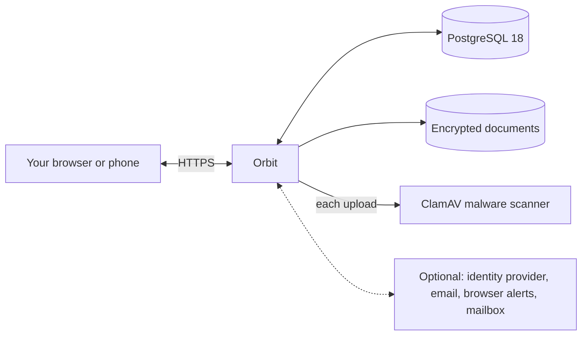

# What Orbit does

Orbit keeps track of the things a home has to remember: servicing, renewals,
inspections, contracts and cover, and who in the household shares them. It
runs on your own server. The [website](https://tomlawesome.github.io/orbit-site/)
tells the story; this page is the plain description behind it. The
[v1 charter](v1-charter.md) is the formal statement of what a stable release
must do.

## The screens

The screenshots below are the real app, filled with made-up data for a
made-up household. They hold no real accounts or settings.

### Your sky

  

The home screen is "your sky": the year drawn as a dial, with your household
at the centre and today at the top. Each thing you look after is a body on
its own orbit. The closer it sits to the centre, the sooner it is due;
overdue items sit inside the inner ring. The "key" tab on the right explains
the colours and sizes. The search box at the bottom, "explore your world",
finds items and documents.

### One item

  

Open any body in the sky to see that item: when it is due, how often it comes
round, what it costs, who provides it, its reference and its reminders. From
here you can complete it, reschedule it, snooze it, edit it or retire it.
Complete it and Orbit works out the next date for you. Documents attached to
the item sit beside it, stored encrypted. The items before and after it in
date order sit either side, so you can step through them.

### The inbox

  

Everyone gets their own relay address. Forward a bill or a policy to it and
the inbox shows "what your relay has caught": what Orbit read from the
attachment, and whether the attachment passed the malware scan. Nothing is
added until you choose "Add to orbit". Anything left unreviewed is removed
after 45 days, and Orbit only ever reads copies of your mail. An
administrator sets up the mailbox first: see
[the mailbox](administrator-operations.md#mailbox-provider-operation).

### Settings

  

Settings holds your own choices: how you sign in, which of the five themes
your sky uses (star-chart, after dark, clouds, dawn and retrograde; after dark
is the default), when reminders arrive and whether by email or browser alert,
and your relay address. "Watch the tour" replays the short tour film
that Orbit offers once you have a household. Settings for the whole instance live on the
administration screen instead.

## Around your household

- **Share the load.** A household's owner can add people who already have an
  Orbit account, or send an invitation by email. Owners can also hand the
  household over to someone else.
- **Sections that fit.** Home, Vehicles, Devices and Services to begin with.
  Add, rename, reorder and recolour your own.
- **On your phone.** The main screens have their own phone layout. Orbit
  installs like an app and can send browser alerts. Your household's data
  stays on your server: the app keeps no copy of it on the phone, and changes
  are never saved up to send later.
- **Private by design.** Use Orbit's own accounts, or an identity provider you
  already run (any OpenID Connect provider, such as Authentik). Nobody sees a
  household without signing in. See [Authentication](authentication.md).

## One app. Standard parts.

- **You bring** a Linux machine with Docker, and an HTTPS address for it.
- **It runs** three containers: Orbit itself, the official PostgreSQL 18
  image for your records, and the official ClamAV image, which checks every
  upload before it is kept. ClamAV wants about 4 GiB of memory. An
  administrator can turn scanning off, and Orbit then marks later uploads as
  not scanned.
- **If you like**, add email reminders, browser alerts, an identity provider
  and the mailbox your relay forwards into. Two heavier services are also
  optional: a document text reader (Apache Tika) and a private AI model
  server (Ollama). See [Running Orbit](operating.md#optional-document-services).
- **Your data** stays on your own disk: records in the database, documents
  encrypted with a separate key for each one. [Encryption at
  rest](encryption-at-rest.md) says what that protects and what it does not.
- **Updates**: run the launcher again and choose Update. Every release is
  pinned to one exact build, and your settings carry over. See
  [Installing Orbit](installing.md).
