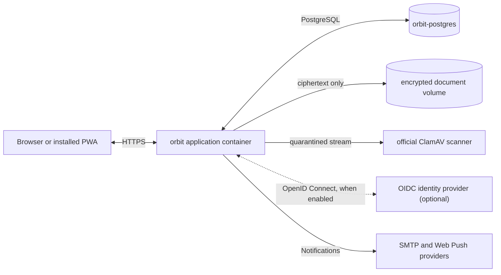

# What Orbit does

A tour of Orbit's screens and features, and the small set of services it
runs on. The [v1 charter](v1-charter.md) is the formal statement of what a
stable release must do.

## A quick visual tour

These screenshots show the real Orbit application using deterministic synthetic
household, item, document and mailbox data. They contain no live accounts,
provider settings or infrastructure details.

  

  

  

  

The captures show synthetic data only. They are static assets under
`docs/assets/product-tour/`: the browser test that used to regenerate them
went with the Next application (#735), and ordinary browser tests do not
write documentation assets.

<table>
  <tr>
    <td width="33%" valign="top">
      <h3>See what is next</h3>
      
A focused, urgency-aware workspace brings upcoming work, overdue items, and recently completed tasks into view.

    </td>
    <td width="33%" valign="top">
      <h3>Keep the rhythm</h3>
      
Complete, renew, reschedule, snooze, cancel, restore, and automatically calculate the next recurring date.

    </td>
    <td width="33%" valign="top">
      <h3>Share the load</h3>
      
Household owners can add existing Orbit users by display name—without invitations or exposed email addresses.

    </td>
  </tr>
</table>

## Designed around your household

- **A workspace that reads at a glance** — responsive Due Next view, search,
  urgency filters, household switching, section views, and mobile navigation.
- **Sections that fit your life** — add, rename, reorder, recolour, hide, or
  restore sections, with Home, Vehicles, Devices, and Services included by
  default.
- **Appearance with personality** — independent light, dark, and system modes
  across Orbit After Dark, Verdant, Coast, Berry, and Ember colourways, three
  in-app text sizes, and traditional or theme-matched due-date heat maps.
- **A complete record of care** — item details, schedule history, activity
  timelines, archived records, reminders, notification state, and encrypted
  supporting documents.
- **Installable without private offline storage** — a PWA shell and
  service-worker push handling, while authenticated workspace data remains
  server-authoritative and changes are never queued for later replay.
- **Private by design** — local password accounts are always available, and
  an identity provider is optional. Sign-in state stays on the server, and
  every request is checked to be genuine and to come from Orbit's own
  address before it can touch household data.

## One app. Standard supporting services.

Orbit deliberately keeps the operational footprint small:

- `orbit` is the whole Orbit application: the interface, the signed-in APIs,
  the database migrations and the notification scheduler. It is either built
  from source or pulled by exact build fingerprint (`ORBIT_IMAGE` must name a
  registry digest).
- `orbit-postgres` is the official PostgreSQL 18 Alpine image, pinned to one
  exact build, with a persistent volume.
- `orbit-clamav` is the official malware scanner image. It receives only
  quarantined file streams over a private network and has no port on the host,
  no database credentials, no document volume and no Orbit secrets.

There is no custom PostgreSQL image and no separate frontend and backend to
maintain. ClamAV is on by default and normally needs about 4 GiB of memory.
An administrator can turn it off, but Orbit then shows a permanent warning and
marks every later upload as unscanned.
## Production foundation

Orbit already includes:

- a first-run setup wizard, instance administrators, and household membership
  controlled by each household's owner;
- create, edit, schedule, remind, archive, undo and restore;
- recurrence suggestions and calendar-date rules that follow the household's
  own timezone;
- a notification centre that knows the schedule, with read, dismiss and
  snooze;
- per-user choices for email and browser-push delivery;
- household ownership transfer that happens all at once and is written to
  the audit history;
- a PostgreSQL database (managed with Drizzle) for users, sessions,
  households, memberships, items, events, reminders, push devices, delivery
  state and audit history;
- local password accounts, always available, plus optional sign-in through
  any standard OpenID Connect provider using the recommended flow
  (Authorization Code with PKCE) — see
  [authentication.md](authentication.md);
- when a provider is on, accounts are created at first sign-in and tied
  permanently to that provider's identity for the person;
- email and browser-push delivery through a scheduler that uses PostgreSQL
  to make sure each notification is claimed once;
- a sign-in gate that shows nothing about a workspace or a household to
  signed-out visitors;
- production health checks, a standalone server build, a purpose-built
  browser favicon, and version-controlled migrations;
- document uploads (PDF, JPEG, PNG) with size limits, malware rejection by
  ClamAV, a separate encryption key for each document, quotas, audited
  downloads, soft deletion, timed purge and storage reconciliation — see
  [Encryption at rest](encryption-at-rest.md) for what this protects,
  what it does not, and why.

Orbit does not keep workspace data or pending changes in the browser's own
storage. It removes the old preview-build IndexedDB database before a session
starts and on sign-out, and its service worker never caches API or sign-in
responses. Production images contain no sample households or seeded records.
