# Orbit quality and CI strategy

## Objective

Quality is the ability to make a release claim and produce proportionate
evidence for it. Orbit does not target a number of tests. It maps each
requirement in the [v1 charter](v1-charter.md) to the cheapest reliable tests,
then adds higher-level evidence only where boundaries or real integrations
require it.

The delivery decisions are recorded in
[ADR-0002](adr/0002-evidence-driven-delivery.md) and
[ADR-0003](adr/0003-gitflow-preview-and-stable-channels.md).

## Test-first policy

- **Defect:** commit or demonstrate a failing regression test that reproduces
  the incorrect behaviour before implementing the fix.
- **New behaviour:** write acceptance cases and failing domain, service,
  contract, or browser tests before implementation where the interface is
  sufficiently understood.
- **Refactor:** add characterization tests around the behaviour and boundaries
  being changed before restructuring them.
- **Exploratory UI:** a disposable prototype may inform the specification, but
  merged production behaviour requires acceptance criteria and automated
  evidence.
- **Security or privacy:** include denial, enumeration, stale-authority,
  malformed-input, and safe-error cases, not only the successful path.

Tests must assert observable behaviour. Avoid tests that duplicate
implementation details, snapshots with no reviewed meaning, or mocks that
remove the boundary the test claims to prove.

## Test layers

| Layer | Purpose | Typical subjects | CI position |
| --- | --- | --- | --- |
| Static | Catch invalid types, imports, unsafe patterns and style defects | TypeScript, ESLint, workflow/governance validation | first, parallel where useful |
| Unit/domain | Prove deterministic rules cheaply | dates, recurrence, validation, state reducers, crypto envelopes, safe categories | first |
| Service/repository integration | Prove transactions, constraints, leases and authorization with PostgreSQL | workspace commands, membership, documents, jobs, archives, account lifecycle | before image publication |
| Route/API integration | Prove HTTP schema, sessions, CSRF, cache policy, status and non-disclosure | all critical route groups | before image publication |
| Adapter contract | Prove bounded behaviour at replaceable external boundaries | OIDC, ClamAV, Tika, SMTP, IMAP, Web Push, local storage | before enabling that adapter |
| Browser/accessibility | Prove critical user journeys and rendered privacy | OIDC sign-in, households, items, documents, admin, mobile, keyboard, axe | exact production image |
| Container/operational | Prove runtime identity, migrations, health, secrets, restart, backup/restore and degraded dependencies | Compose topology and scripts | exact production image |
| Representative manual | Prove operator and provider realities that cannot be safely automated | real OIDC, update, SMTP/push where enabled, protected-preview deployment and restore | preview feedback or release acceptance |

Unit tests may mock I/O. Integration tests use real PostgreSQL and isolated
temporary storage. Contract tests may use disposable protocol implementations,
but must not add production authentication bypasses.

## Requirement traceability

Every delivery issue cites one or more v1 requirement IDs or explains why it is
non-v1 maintenance. The pull request links the issue and records:

- tests added at each relevant layer;
- negative and failure paths;
- migrations and upgrade evidence;
- documentation and operator impact;
- the CI run and, when applicable, preview digest and manual result.

The [engineering baseline](engineering-baseline.md) is a dated audit. GitHub
issues are the live status; durable requirements remain in version control.

## Coverage policy

Coverage is collected for diagnostic visibility. The initial baseline does not
fail on a global percentage.

1. Publish text and machine-readable coverage from the fast test job.
2. Use uncovered critical modules and branches to refine risk-ranked issues.
3. Exclude generated declarations, tests, and intentionally declarative assets;
   do not exclude difficult production code merely to improve a number.
4. Ratcheting thresholds are active (vitest.config.ts, issue #302): global
   floors just under the measured baseline (29.5% statements, 2026-08-12)
   plus per-layer floors for scaffolded layers (`src/lib` 60%,
   `src/server/documents` 75%). CI fails on regression below a floor.
   Floors are raised when a phase durably lifts a layer and are never
   lowered to make a change pass; no floor is a target.
5. Apply stronger expectations to security, authorization, lifecycle, and
   migration code than to declarative UI composition.

Coverage cannot prove authorization, concurrency, provider behaviour,
accessibility, or recoverability. Those require the appropriate layer above.

## The v19 type ledger

The SvelteKit front end in `web/` is outside `pnpm typecheck`: the root
`tsconfig.json` sets `"allowJs": false` and includes only `**/*.ts` and
`**/*.tsx`, and `web/src` holds no TypeScript. Its own checker, `svelte-check`,
had no caller in CI until #620, so 1,644 errors accumulated across 52 files --
overwhelmingly implicit `any` and DOM narrowing rather than defects.

Gating on zero would fail every pull request from day one; leaving it off lets
the pile grow unseen. So `web/svelte-check-ceiling.json` records what each file
is allowed today and `scripts/check-v19-types.mjs` enforces it from the fast
job, on the same ratchet principle as the coverage floors above and with one
addition:

1. A file that gets worse fails.
2. A file that gets **better** also fails, asking for its number to be lowered.
   Exact match is what walks the ledger down to nothing rather than leaving
   slack nobody reclaims. `svelte-check` is deterministic against a frozen
   lockfile, so this cannot flap.
3. A file with no entry may have no errors, so everything M2 writes fresh is
   held at zero automatically.
4. Entries are never added and never raised. Lowering one and deleting one are
   the only edits that move this forward.

This is a holding position for the duration of the v19 rebuild, not a standard.
**M2 does not close while the ledger has entries in it** (#624): the rebuild is
what makes the tolerance removable, so each screen it rewrites should land
clean and drop its entry in the same pull request. When the ledger is empty the
gate becomes a plain zero-error check and both files go.

The same job compiles `web/` (`pnpm --filter orbit-web build`, about ten
seconds). Before that, a `.svelte` file that did not compile could merge green
and first fail at the container build on the `preview` push.

## CI target

```mermaid
flowchart LR
    issue["Issue PR: static + unit"]
    dev["Protected dev"]
    train["Merge dev into preview"]
    integration["PostgreSQL service/API + migrations"]
    build["Build one production image"]
    system["Compose + browser + security + recovery against that image"]
    supply["SBOM + dependency/image scan + provenance"]
    preview["Publish preview digest"]
    manual["Representative release acceptance"]
    stable["Verify preview into main without rebuild"]
    promote["Promote exact digest"]

    issue --> dev --> train --> integration --> build --> system
    system --> supply --> preview --> manual --> stable --> promote
```

Protected previews are published only after source dependency/secret policy,
exact-image vulnerability and SBOM evidence, and the complete system gates
pass. Trusted publication then attaches and verifies digest-bound provenance
and SBOM attestations. The exact digest is eligible for stable acceptance only
when this complete path passes.

Pull requests also receive a read-only dependency-diff review. Newly
introduced high or critical vulnerabilities in any dependency scope and
dependencies outside the approved SPDX licence policy block integration.

### Risk-proportional pull-request lanes

Every pull request runs lint, type checking and the complete unit suite. Separate read-only workflows retain dependency-diff review
and CodeQL. Higher-cost evidence is concentrated on the protected release lane:

| Lane | Additional evidence | Typical eligible change |
| --- | --- | --- |
| issue pull request | static analysis and unit regression evidence | ordinary work targeting `dev` or a release-lane merge proposal |
| protected preview push | production build, source dependency/secret policy, two isolated PostgreSQL runs, exact-image Compose, vulnerability, malware, recovery, browser/accessibility, installer and digest-bound attestations | accepted merge to `preview` or a bounded `hotfix/**` source |
| stable pull request | existing preview digest, embedded identity and attestation verification | `preview` or a tested hotfix proposed to `main` |

The deterministic changed-boundary classifier remains fail-safe for reporting
and for the authoritative protected push. Required higher-cost job identities
are skipped at job level on pull requests so branch protection still receives
terminal check results; workflow-level path filters are not used.

Pull requests run static and unit checks without a production application or
container build. Every accepted push to protected `preview` or `hotfix/**`
runs the complete exact-image system and publication path, so integration and
release evidence is never inferred from a cheaper pull-request lane. Until a
forge-native combined-state queue is available, only one release train is
admitted to protected CI at a time while
independent implementation and local validation continue concurrently.

### Required behaviour

- Superseded runs are cancelled where safe.
- Pull requests have read-only permissions and never publish mutable release
  tags.
- Third-party actions are pinned to reviewed immutable commits.
- Dependency-change review uses read-only permissions, blocks newly introduced
  high/critical vulnerabilities in every scope and enforces the approved SPDX
  licence set.
- Test data and OIDC identities are disposable.
- Secrets are unavailable to untrusted pull-request code.
- Build output is identified once, loaded into Compose for system tests, and
  published only if that exact identity passes.
- AMD64 is the supported preview architecture. ARM64 publication requires a
  dedicated exact-image validation path before it can be enabled for a preview
  or release.
- Reports required for diagnosis are retained for a bounded period.
- Raw secret matches are never retained as artifacts; CI uploads only sanitized
  finding identity and policy decisions.
- High and critical dependency/image findings fail closed unless an owned,
  justified, linked and unexpired vulnerability exception matches exactly.
  All repository secret findings fail closed without an exception path.
- Scanner and attestation tooling is immutable at execution time, with
  provenance, licence, update ownership and review dates recorded in the
  [supply-chain policy](supply-chain.md).
- Upstream build, database, scanner, parser, optional-AI and disposable-test
  images are pinned to reviewed Linux/AMD64 manifests. Configuration tests
  reject untracked mutable references, and pulled Orbit deployments require an
  explicit application digest.
- Stable promotion accepts only a tested protected preview, derives its
  semantic version from the image, validates its source revision in `main` plus
  exact `main` tree identity, and never replaces an existing Git version.

## Required test scenarios by risk

### Authentication and authorization

- signed-out, malformed-session, disabled-user, member, owner, outsider and
  instance-administrator cases;
- removed membership and rotated/revoked session on the next request;
- cross-household identifiers return non-disclosing responses;
- missing/wrong CSRF and origin fail before mutation;
- provider discovery, signature, issuer, audience, nonce, PKCE and callback
  failures.

### Data and lifecycle

- fresh migrations and upgrade from the oldest explicitly supported version;
- concurrent ownership, quota, lease and state-transition conflicts;
- worker crash after claim, after durable intent, and after external side
  effect;
- synchronous clean `201`, invalid/malware terminal discard, retryable
  unavailable/timeout/protocol `202` recovery, generic scanner-error `503`,
  repeat-request idempotency and `409` content/scope mismatch;
- encrypted staging privacy/AAD separation, no download/draft/parse/action
  authorization, duplicate workers, ten-minute lease expiry and stale-worker
  fencing, restart recovery, five attempts/manual retry/immutable 24-hour
  expiry, purge failure backlog, and reviewed pending attachment;
- backup/restore with missing, extra, corrupt and mixed-state document objects;
- backup/restore with in-flight encrypted scanner stages, correspondence
  validation, lease reset and requeue, with no plaintext quarantine archive;
- wrong or missing recovery key and interrupted restore;
- archive conflict and failure atomicity.

### Hostile inputs and integrations

- MIME mismatch, truncation, oversize, traversal, malformed document and
  malware cases;
- parser timeout, oversized output and hostile extracted instructions;
- provider outage, timeout, rejection, malformed response and bounded retries;
- admin counts/categories/expiry/retry/purge surfaces and user distinctions
  between recoverable outage, active retry, terminal rejection and success;
- no private content, filenames, addresses, endpoints, tokens or raw provider
  errors in logs and administrator responses.

### User experience

- authenticated core journeys on desktop and mobile;
- keyboard-only operation, focus management, text scaling, themes, contrast and
  automated accessibility;
- offline snapshot isolation, queued-command conflicts, retry, logout and local
  storage clearing if offline support remains advertised;
- understandable feedback timing and recovery from failed actions.

## Definition of done

An issue is complete only when:

- its acceptance criteria and non-goals still match the delivered scope;
- required tests were added and pass locally or in the strongest available
  clean environment;
- negative security/privacy cases pass;
- migrations, backward compatibility, backup/restore, deployment and rollback
  effects are addressed;
- documentation and ADRs reflect durable decisions without duplicating live
  status;
- the final diff is reviewed for unrelated files, secrets, personal data,
  debug output and dependency surprises;
- required CI passes;
- manual preview evidence is linked when the issue changes a real provider,
  deployment, upgrade, recovery, browser, or hardware-dependent boundary;
- protected-preview evidence is required at the feature-complete
  release gate.

Issue closure records the pull request and evidence. Passing unit tests alone is
not sufficient evidence for a cross-boundary change.
