# Orbit quality and CI strategy

## Objective

Quality is the ability to make a release claim and produce proportionate
evidence for it. Orbit does not target a number of tests. It maps each
requirement in the [v1 charter](v1-charter.md) to the cheapest reliable tests,
then adds higher-level evidence only where boundaries or real integrations
require it.

The delivery decision is recorded in
[ADR-0002](adr/0002-evidence-driven-delivery.md).

## Test-first policy

- **Defect:** commit or demonstrate a failing regression test that reproduces
  the incorrect behaviour before implementing the fix.
- **New behaviour:** write acceptance cases and failing domain, service,
  contract, or browser tests before implementation where the interface is
  sufficiently understood.
- **Refactor:** add characterization tests around the behaviour and boundaries
  being changed before restructuring them.
- **Exploratory UI:** a disposable prototype may inform the specification, but
  merged production behaviour requires acceptance criteria and automated
  evidence.
- **Security or privacy:** include denial, enumeration, stale-authority,
  malformed-input, and safe-error cases, not only the successful path.

Tests must assert observable behaviour. Avoid tests that duplicate
implementation details, snapshots with no reviewed meaning, or mocks that
remove the boundary the test claims to prove.

## Test layers

| Layer | Purpose | Typical subjects | CI position |
| --- | --- | --- | --- |
| Static | Catch invalid types, imports, unsafe patterns and style defects | TypeScript, ESLint, workflow/governance validation | first, parallel where useful |
| Unit/domain | Prove deterministic rules cheaply | dates, recurrence, validation, state reducers, crypto envelopes, safe categories | first |
| Service/repository integration | Prove transactions, constraints, leases and authorization with PostgreSQL | workspace commands, membership, documents, jobs, archives, account lifecycle | before image publication |
| Route/API integration | Prove HTTP schema, sessions, CSRF, cache policy, status and non-disclosure | all critical route groups | before image publication |
| Adapter contract | Prove bounded behaviour at replaceable external boundaries | OIDC, ClamAV, Tika, SMTP, IMAP, Web Push, local storage | before enabling that adapter |
| Browser/accessibility | Prove critical user journeys and rendered privacy | OIDC sign-in, households, items, documents, admin, mobile, keyboard, axe | exact production image |
| Container/operational | Prove runtime identity, migrations, health, secrets, restart, backup/restore and degraded dependencies | Compose topology and scripts | exact production image |
| Representative manual | Prove operator and provider realities that cannot be safely automated | real OIDC, update, SMTP/push where enabled, candidate deployment and restore | candidate acceptance |

Unit tests may mock I/O. Integration tests use real PostgreSQL and isolated
temporary storage. Contract tests may use disposable protocol implementations,
but must not add production authentication bypasses.

## Requirement traceability

Every delivery issue cites one or more v1 requirement IDs or explains why it is
non-v1 maintenance. The pull request links the issue and records:

- tests added at each relevant layer;
- negative and failure paths;
- migrations and upgrade evidence;
- documentation and operator impact;
- the CI run and, when applicable, candidate digest and manual result.

The [engineering baseline](engineering-baseline.md) is a dated audit. GitHub
issues are the live status; durable requirements remain in version control.

## Coverage policy

Coverage is collected for diagnostic visibility. The initial baseline does not
fail on a global percentage.

1. Publish text and machine-readable coverage from the fast test job.
2. Use uncovered critical modules and branches to refine risk-ranked issues.
3. Exclude generated declarations, tests, and intentionally declarative assets;
   do not exclude difficult production code merely to improve a number.
4. After the PostgreSQL/API harness exists, set ratcheting thresholds that do
   not permit regression from the measured baseline.
5. Apply stronger expectations to security, authorization, lifecycle, and
   migration code than to declarative UI composition.

Coverage cannot prove authorization, concurrency, provider behaviour,
accessibility, or recoverability. Those require the appropriate layer above.

## CI target

```mermaid
flowchart LR
    fast["Static + unit + diagnostic coverage"]
    integration["PostgreSQL service/API + migrations"]
    build["Build one production image"]
    system["Compose + browser + security + recovery against that image"]
    supply["SBOM + dependency/image scan + provenance"]
    candidate["Publish candidate digest"]
    manual["Representative manual acceptance"]
    promote["Promote exact digest"]

    fast --> integration --> build --> system --> supply --> candidate --> manual --> promote
```

### Required behaviour

- Superseded runs are cancelled where safe.
- Pull requests have read-only permissions and never publish mutable release
  tags.
- Third-party actions are pinned to reviewed immutable commits.
- Test data and OIDC identities are disposable.
- Secrets are unavailable to untrusted pull-request code.
- Build output is identified once, loaded into Compose for system tests, and
  published only if that exact identity passes.
- AMD64 is the routine candidate architecture; ARM64 is deliberate release
  validation rather than an every-commit cost.
- Reports required for diagnosis are retained for a bounded period.
- Stable promotion validates source ancestry and tree identity and never
  replaces an existing version.

## Required test scenarios by risk

### Authentication and authorization

- signed-out, malformed-session, disabled-user, member, owner, outsider and
  instance-administrator cases;
- removed membership and rotated/revoked session on the next request;
- cross-household identifiers return non-disclosing responses;
- missing/wrong CSRF and origin fail before mutation;
- provider discovery, signature, issuer, audience, nonce, PKCE and callback
  failures.

### Data and lifecycle

- fresh migrations and upgrade from the oldest explicitly supported version;
- concurrent ownership, quota, lease and state-transition conflicts;
- worker crash after claim, after durable intent, and after external side
  effect;
- backup/restore with missing, extra, corrupt and mixed-state document objects;
- wrong or missing recovery key and interrupted restore;
- archive conflict and failure atomicity.

### Hostile inputs and integrations

- MIME mismatch, truncation, oversize, traversal, malformed document and
  malware cases;
- parser timeout, oversized output and hostile extracted instructions;
- provider outage, timeout, rejection, malformed response and bounded retries;
- no private content, filenames, addresses, endpoints, tokens or raw provider
  errors in logs and administrator responses.

### User experience

- authenticated core journeys on desktop and mobile;
- keyboard-only operation, focus management, text scaling, themes, contrast and
  automated accessibility;
- offline snapshot isolation, queued-command conflicts, retry, logout and local
  storage clearing if offline support remains advertised;
- understandable feedback timing and recovery from failed actions.

## Definition of done

An issue is complete only when:

- its acceptance criteria and non-goals still match the delivered scope;
- required tests were added and pass locally or in the strongest available
  clean environment;
- negative security/privacy cases pass;
- migrations, backward compatibility, backup/restore, deployment and rollback
  effects are addressed;
- documentation and ADRs reflect durable decisions without duplicating live
  status;
- the final diff is reviewed for unrelated files, secrets, personal data,
  debug output and dependency surprises;
- required CI passes;
- manual candidate evidence is linked when the issue changes a real provider,
  deployment, upgrade, recovery, browser, or hardware-dependent boundary.

Issue closure records the pull request and evidence. Passing unit tests alone is
not sufficient evidence for a cross-boundary change.
